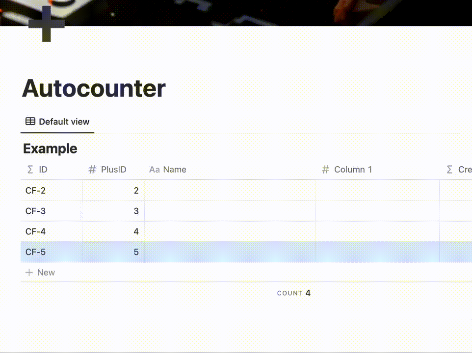

# Notion Plus ID

> More information at [https://notionplusid.app](https://notionplusid.app)

This repository is the source code for the Notion Plus ID utility. The provided code is used both for the publicly available and convinient version. Also it can be used to run a private version for people/organisations that may require higher control over security and used resources.

## How to run private Notion Plus ID for free
### 1. Setup the infrastructure
The infrastructure setup is defined within the `tf` subrepo via [Terraform](https://www.terraform.io/). 

More specific steps [here](./tf/README.md).

### 2. Deploy the code
The main logic is written in Go and is designed to run in a Docker container. 

The current implementation is also optimised for [GCP App Engine](https://cloud.google.com/appengine) runtime with the usage of [GCP Datastore (Firestore)](https://cloud.google.com/datastore). The default configuration would allow you to run the Notion Plus ID **for free** as the typical resource consumption is within the App Engine's [Free Tier](https://cloud.google.com/free/docs/free-cloud-features#app-engine).

More detailed steps [here](./app/README.md).

### 3. Enable the Notion Plus ID for your Notion database
You need to make sure that your database is configured for Notion Plus ID to work.

More details [here](https://notionplusid.app/welcome).

## Structure of the repository
| Module | Path              | Description                                       |
|--------|-------------------|---------------------------------------------------|
| app    | [./app](./app/)   | The core business logic written in Go             |
| tf     | [./tf](./tf/)     | Infrastructure configuration defined in Terraform |

## FAQ
### Why would I want to run my own private version of Notion Plus ID?
In case if your security concerns outweight the convinience provided by the publicly available free version, you can run your private instance in less than 5 minutes just by following [the instructions](./README.md#how-to-run-private-notion-plus-id-for-free).

### What kind of infrastructure is used?
Currently the provided infrastructure configuration is based on Google Cloud Platform (aka GCP).
The specific components that are being leveraged:
#### [GCP App Engine](https://cloud.google.com/appengine)
App Engine is used as the main runtime environment for the business logic implemented in Go.
#### [GCP Cloud Storage](https://cloud.google.com/storage)
Cloud Storage buckets are used to persist the Terraform state.
#### [GCP Datastore](https://cloud.google.com/datastore)
The main persistance layer for the application.
#### [GCP Secrets Manager](https://cloud.google.com/secret-manager)
To keep your internal secret access token to your Notion safely.

### Why Google Cloud?
Google Cloud conviniently provides flexible environment (such as App Engine) that, given the resource consumption, is near free-of-charge with minimal maintenance required. App Engine allows to run applications packed into containers. Such containers can be also ran in different environments/clouds if necessary. Thus the configuration is not per-se "cloud provider specific".

### Can I run my private instance of Notion Plus ID on other cloud providers?
You can! The current configuration, even though is extendible, primarily focuses on GCP as the most viable cloud provider for the case. Therefore, you might need to implement additional configuration and functionality to deploy Notion Plus ID into other clouds (as Datastore is not be available outside of GCP and current Terraform is very GCP specific). Given that the rest of the infrastructure requirements are expected to run everywhere else (the `app` can be easily packed into a Docker container). Pull Requests are always encouraged and welcomed!

### Is there a public version of Notion Plus ID that I can just use?
Absolutely! Check out [https://notionplusid.app](https://notionplusid.app) along with our [Privacy Policy](https://notionplusid.app/privacy-policy) and [Terms & Conditions](https://notionplusid.app/tnc). It should be as easy as just clickin on `Install extension`.

### How do I know the code is safe and secure?
Check it out for yourself! That's why the application is open-sourced. To encourage transparency and trust.

### Is there any tracking within the code that I should know about?
No. Check it out for yourself! That's why the application is open-sourced. To encourage transparency and trust.

### Why do the deployment configuration defaults to the `us-east2` region?
Currently, Notion API is hosted within the `us-east2` region. By making sure our application is also running within the same region, we are decreasing the network latency thus enabling better experience for you and other users within your Notion workspace.